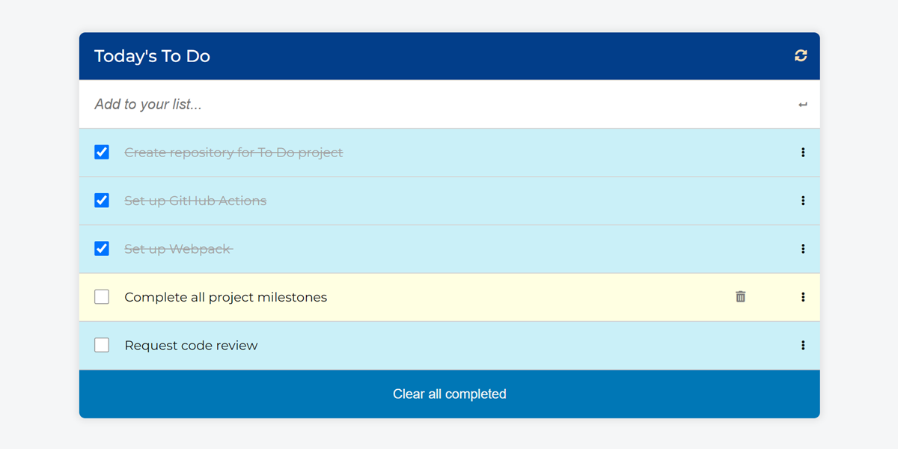

# To Do List

> In this project, I built a basic HTML list of To Do tasks using webpack. Tasks can be added, removed and updated.

## Screenshot

## Built With

- HTML
- CSS/SCSS
- JavaScript(ES6)
- Webpack

## Live site 🚀

🔗 [Live Site Link](https://dewslyse.github.io/mv-to-do-list/)

## Getting Started

To get a local copy up and running follow this simple step:

- Clone repository to your local machine: `git@github.com:dewslyse/awesome-books-mv.git`
- Run `npm install` to install dependencies

## Author

👤 **@dewslyse**

- GitHub: [@dewslyse](https://github.com/dewslyse)

## 🤝 Contributing

Contributions, issues, and feature requests are welcome!

Feel free to check the [issues page](../../issues/).

## Show your support

Give a ⭐️ if you like this project!

## Acknowledgments

- Hat tip to anyone whose code was used
- Inspiration
- etc

## 📝 License

This project is [MIT](./LICENSE) licensed.
